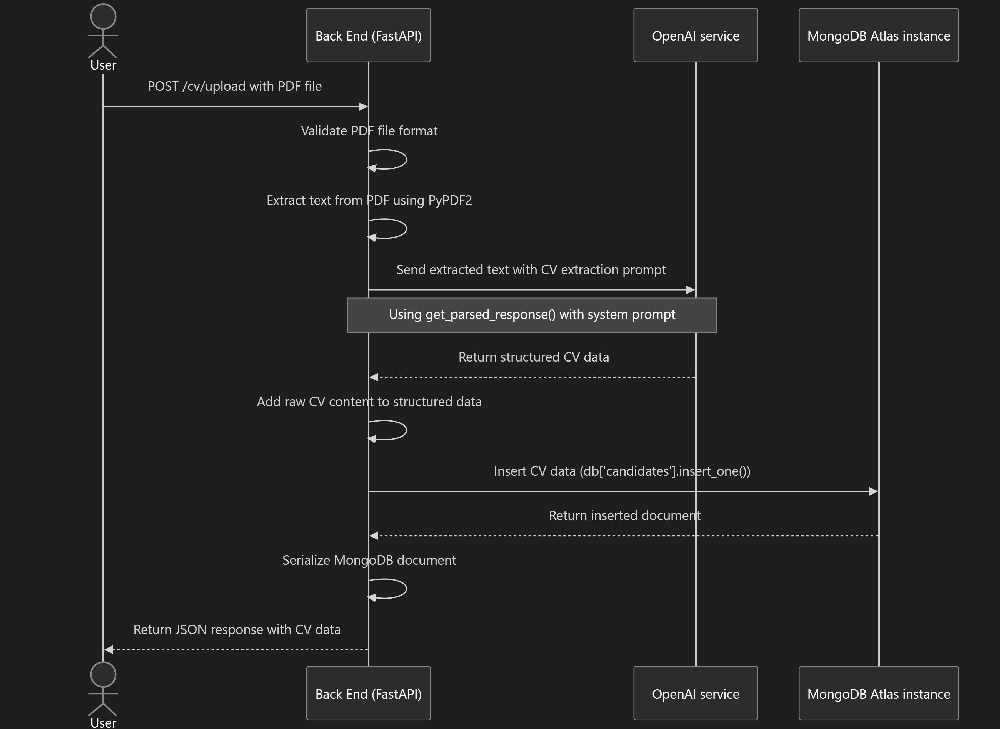
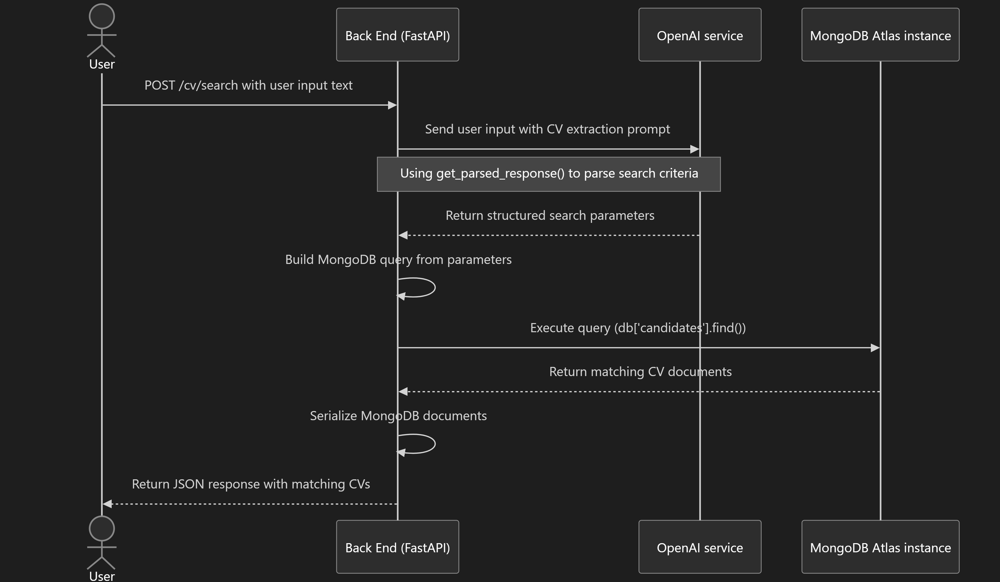

# CV RAG API

A FastAPI application for CV (resume) upload and search using RAG (Retrieval-Augmented Generation).

## Features

- Upload CV in PDF format
- Search for CVs based on natural language input
- Automatic extraction of CV information using LLM
- MongoDB storage for CV data

## Prerequisites

- Python 3.8+
- MongoDB

## Installation

1. Clone the repository:

```bash
git clone <repository-url>
cd <repository-directory>
```

2. Install the required packages:

```bash
uv venv
uv pip install -r requirements.txt
```

3. Create a `.env` file in the root directory with the following variables:

```
MONGODB_CONNECTION_STRING=mongodb://localhost:27017
MONGODB_DATABASE=cv_rag_db
OPENAI_API_KEY=your_openai_api_key
```

## Running the Application

Start the application with:

```bash
python main.py
```

The API will be available at `http://localhost:8000`.

You can access the interactive API documentation at `http://localhost:8000/docs`.

## API Endpoints

### Upload CV

```
POST /cv/upload
```

Uploads a CV in PDF format, extracts information using OpenAI, and stores it in MongoDB.



### Search CV

```
POST /cv/search
```

Searches for CVs based on natural language input, using OpenAI to parse search criteria and MongoDB to find matching documents.



## Development

To run the application in development mode with auto-reload:

```bash
uvicorn main:app --reload
```
